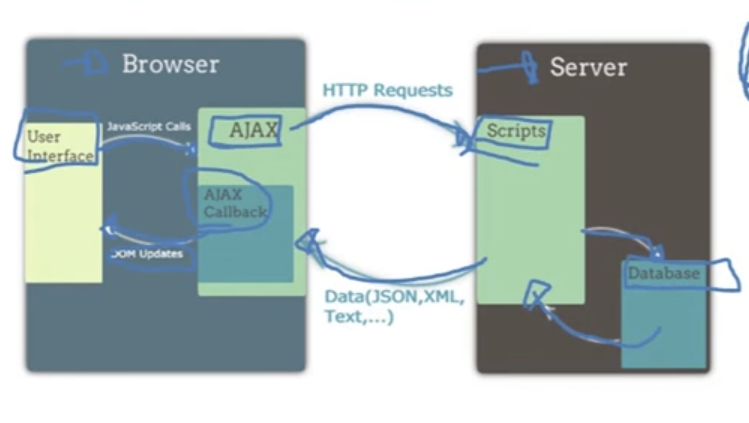

# Mexendo com Ajax + API em 2026

Objetivo é aprender o que é e como funciona Ajax. Basicamente Ajax é um conjunto de tecnologias, trabalhando com DOM (Document Object Model), CSS e XML na linguagem de JavaScript. Por isso Ajax é acrônimopara Asynchronous. Com exemplo simples, Ajax funciona com a requisição do usuario ao servidor, atualizando e trazendo informações ao usuario de forma rápida, sem ser necessário fazer o "Reload" na tela. O processo Inicial de carregamento é mais lento que de uma aplicação comum, pois muitas informações são pré-carregadas. Mas depois, somente os dados são carregados, tornando assim o site mais rápido.

# Ajax na Prática

Neste arquivo aprendi alguns conceitos. Resultado: [Requisição com metodo GET, pesquisa usuarios e mostra seus dados, usando AJAX](index.html)

Usando Ajax para:

Consumir uma API do git hub (ex: nome de usuário e suas informações)

Mostrar dados na tela

### Documentação:

- https://youtu.be/DAVOAzTX21U?si=PB_gXdDrtErLM3vd
- https://api.jquery.com/jQuery.ajax/
